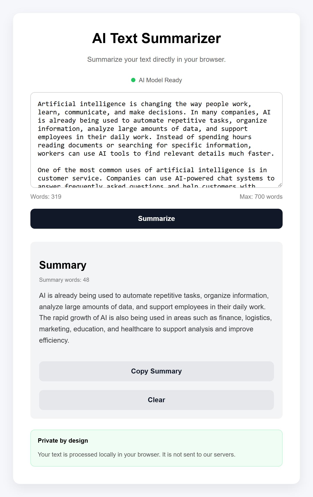

# AI Text Summarizer

A privacy-focused AI text summarizer that runs directly in the browser using Transformers.js.

The application performs text summarization locally on the user's device, without requiring a backend server or external AI API for inference.

## Live Demo

Try the live application:

[Open AI Text Summarizer](https://amirp32.github.io/browser-ai-summarizer/)

## Screenshot



## Features

- AI-powered text summarization
- Runs directly in the browser
- Local text processing
- No backend AI API required
- Transformers.js integration
- Web Worker based inference
- Model loading progress
- AI model status indicator
- Input word counter
- Summary word counter
- Maximum input validation
- Copy summary button
- Clear button
- Loading and error states
- Responsive interface
- Privacy-focused design

## How It Works

The application uses Transformers.js to run a pretrained summarization model directly in the browser.

When the page loads, the AI model is initialized inside a Web Worker. The main JavaScript thread remains responsible for the user interface, while the worker handles computationally intensive AI inference.

When the user clicks **Summarize**:

1. The application validates the input text.
2. `app.js` sends the text to `worker.js` using `postMessage()`.
3. The Web Worker processes the text with Transformers.js.
4. The DistilBART model generates a summary.
5. The worker sends the generated summary back to the main thread.
6. The result is displayed in the user interface.

## Architecture

The application separates the user interface from AI inference using a Web Worker.

```text
User
  │
  ▼
HTML / UI
  │
  ▼
app.js
  │
  │ postMessage()
  ▼
Web Worker
  │
  ▼
Transformers.js
  │
  ▼
DistilBART Model
  │
  ▼
AI Inference
  │
  │ postMessage()
  ▼
app.js
  │
  ▼
Generated Summary
```

This architecture keeps computationally intensive model inference away from the main UI thread and helps keep the interface responsive.

## Key Technical Decisions

- AI inference runs directly in the browser.
- No backend server is required for text summarization.
- Model inference runs inside a Web Worker.
- The UI and worker communicate using message passing.
- Application state tracks model readiness, processing status, and the latest generated summary.
- Input validation prevents excessively long requests.
- Loading and error states provide clear user feedback.
- The Copy button only becomes available after a valid summary is generated.
- The model is reused after loading instead of being initialized for every request.
- Relative file paths are used so the project works correctly when deployed with GitHub Pages.

## Technologies

- HTML5
- CSS3
- JavaScript
- ES Modules
- Transformers.js
- Hugging Face models
- Web Workers
- Browser Clipboard API
- Git
- GitHub
- GitHub Pages

## Skills Demonstrated

- DOM manipulation
- Event handling
- Async / Await
- JavaScript modules
- Web Workers
- Message passing
- Application state management
- Error handling
- Input validation
- Browser APIs
- Responsive CSS
- Client-side AI inference
- Model loading and caching
- Git version control
- GitHub deployment
- Technical documentation

## Privacy

The user's text is processed locally in the browser.

The application does not send the text to an application backend for summarization.

This project demonstrates how client-side AI can reduce backend complexity while keeping user input local during inference.

## Model

The project uses:

`Xenova/distilbart-cnn-6-6`

The model is used for English text summarization through Transformers.js.

## Project Structure

```text
browser-ai-summarizer/
│
├── assets/
│   └── screenshot.png
│
├── index.html
├── style.css
├── app.js
├── worker.js
└── README.md
```

### File Responsibilities

- `index.html` — application structure and interface
- `style.css` — responsive styling and visual states
- `app.js` — UI logic, validation, state management, and communication with the worker
- `worker.js` — AI model loading and text summarization
- `assets/screenshot.png` — project screenshot used in this README

## Run Locally

Clone the repository:

```bash
git clone https://github.com/amirp32/browser-ai-summarizer.git
```

Open the project folder:

```bash
cd browser-ai-summarizer
```

Run the project using a local development server such as the **Live Server** extension in VS Code.

Opening `index.html` directly using `file://` is not recommended because the application uses JavaScript modules and Web Workers.

## Deployment

The project is deployed with GitHub Pages.

The production version is available here:

[https://amirp32.github.io/browser-ai-summarizer/](https://amirp32.github.io/browser-ai-summarizer/)

## Future Improvements

- Multilingual summarization
- User-selectable summary length
- Additional local AI models
- Improved accessibility
- Better progress reporting
- Drag-and-drop text file support
- Download summary as a text file
- Dark mode
- Performance benchmarking across browsers and devices
